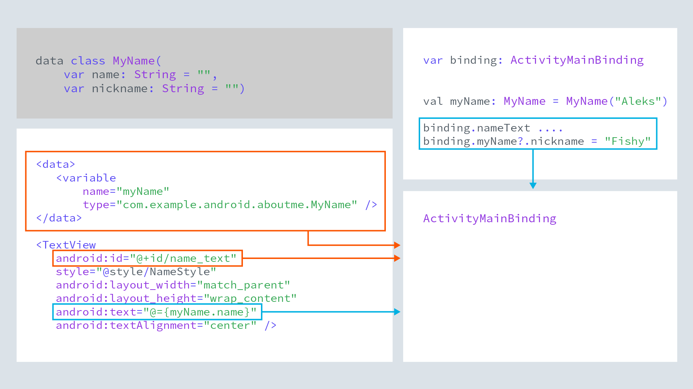

# About me

This project is the part of the **Android Kotlin Fundamentals 02.1**. 

## Learnings from building this app

### Learning Update 1
* Creating layouts using layout editor.
* Working with Linear Layout, ImageView, TextView.

## Learning Update 2
* Adding more complex UI by combining ScrollView , Image View, EditText , buttons and Layout Views.
* Added user interaction through edit text.
* Finding views using findViewById() method.
* Added click listeners to the nickname text.

## Learning Update 3
* Removed findViewById() added data bindings.

### data binding (Udacity Notes - Credits Udacity)
* The idea behind data binding is to create an object that connects two pieces of distant information
together at compile time , so that you don't have to look for it at the runtime.
* The object that surfaces these bindings to you is called the Binding object. It is created by the
compiler.

### Data binding vs findViewById
* findViewById is a costly operation because it traverses the view hierarchy every time it is called.
* with data binding enabled, the compiler creates references to all views in a <layout> that have an
id, and gathers them in a binding object.

Image Credits - udacity

### Data binding views and data
* Updating data and then updating the data displayed in views is cumbersome and a source of errors.
Keeping the data in the view also violates the separation of data and presentation.
* Data binding solves both of these problems. You keep data in a data class. You add a <Data> block to the
<layout> to identify the data as variables to use with the views. Views reference the variables.
* The compiler generates a binding object that binds the views and data,
* In code, you reference and update the data through the binding object, which updates the data, and thus
what is displayed in the view.

Image Credits - udacity

